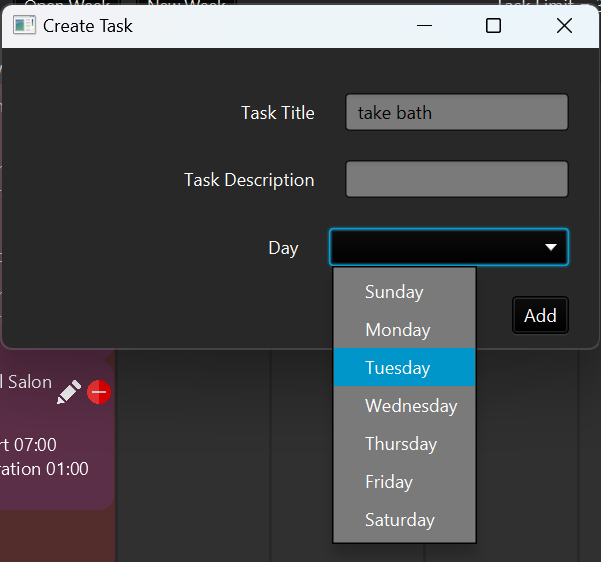

# 3500 PA05 Project Repo

### Project Pitch
Do you have a hard time keeping track of your schedule? The Salty Sea Sprouts Bullet Journal program will solve all 
your scheduling needs. You can create a new week or open a previous week and get to work scheduling tasks and events. 
Set limits for the number of tasks and events to make sure you don't overwhelm your schedule; the application will let
you know when you go over your limits. Change these limits any time by using one of the many shortcuts (CTRL/CMD + L). 
If you don't like using shortcuts, you can also access all options via the menu bar. Need help keeping track of all 
your planned tasks for the week? No worries, there's a built-in task queue that allows you to look at all your tasks in
one place. Want to know how far along you are to finishing all your tasks? Look no further than the daily progress bars!
If you want to get a fuller picture, take a look at the weekly overview, which tells you how many events and tasks you
have for the week as well as the percent of tasks completed. Need to cancel an event or change your mind about some
of your plans? No problem! You can edit or delete any tasks or events. Do you like planning multiple weeks at a time? 
You can also open multiple weeks at a time in different tabs by opening another week or making a new week. When you're 
done, all you have to do is click save to be able to pick up where you left off next time you open the application.
Access this application by conveniently running the jar file! Start your bullet journal journey today!

### Applying SOLID Principles

- S: The program follows the single responsibility principle by ensuring each class has exactly one objective. For
  example, each type of window has a single controller and a single view delegated to it that produce the GUI for that
  window, rather than putting this functionality in the main controller class.
- O: The program follows the open/closed principle by utilizing interfaces and abstract classes for similar classes such
  as the controllers and views. This way, if a new window needed to be added to the application, a new controller and
  view could be created by extending/implementing the relevant interfaces/classes rather than making major changes to
  existing classes. Likewise, if a new type of calendar item were to be added, the existing code could support such a
  change without huge cascading changes elsewhere.
- L: The program follows the Liskov substitution principle by abstracting common features into abstract classes or
  interfaces where possible. For example, in most cases, methods take in a CalendarItem and therefore could take in a
  Task or Event or any other object extending CalendarItem.
- I: The program follows interface segregation by keeping the interfaces as open as possible. For example, classes
  implementing the controller interface simply need a run() method. The interface does not impose any other methods to
  be implemented on the client that would limit/force them in any way. The interfaces in this program only outline the
  highest level of what a class should be able to do and do not care about the specific implementation.
- D: The program follows dependency inversion in multiple ways. For example, all view classes in this program take in
  the controller for it, which is an example of dependency injection. If a different controller was needed, it could
  simply be replaced and nothing would break. Additionally, the program uses dependency inversion by ensuring
  sub-controllers act independently of the main controller. Only the necessary objects/functionality are made available
  to the sub-controller and nothing more. Instead of passing in the entire main controller, the main controller
  implements a listener interface that has a single "on complete" method that can be called from the sub-controller. In
  this way, the details of this interaction between controllers has been abstracted away into an interface.

### How to Extend the Program

To implement sorting by name and duration, we would make two classes (CompareByName and CompareByDuration) that would 
implement Comparator. These comparators could then be used in the week view controller (before populating each vBox,
you would sort the array lists of tasks and events using the desired comparator). Since we also already have shortcuts, 
you could easily add shortcuts to sort them by name or by duration.

### GUI Screenshots
Screenshot of making a new week:

Screenshot of screen when you first load week:

Screenshot of fully booked week:

Screenshot of new event popup: 

Screenshot of new task popup:

Screenshot of open week popup:

Screenshot of edit event popup:

Screenshot of edit max tasks/events popup:

Screenshot of edit task popup:

Screenshot of new tab:

Screenshot of UML diagram:

[PA Write Up](https://markefontenot.notion.site/PA-05-8263d28a81a7473d8372c6579abd6481)
